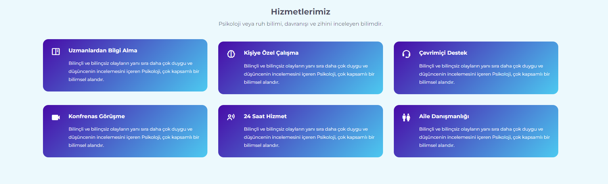
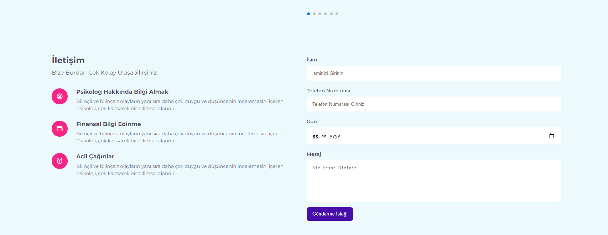

# 📝 Responsive Website

Responsive Website USING HTML CSS  SASS AND JAVASCRIPT







# 💬 We're here to help!

If you get stuck, [shoot us an email](mailto:ozgancan9@gmail.com) .

## Installation

Clone

```bash
git clone https://github.com/Mahmutcano/responsive-sass-javascript-website.git
```

## License

[MIT](https://choosealicense.com/licenses/mit/)
